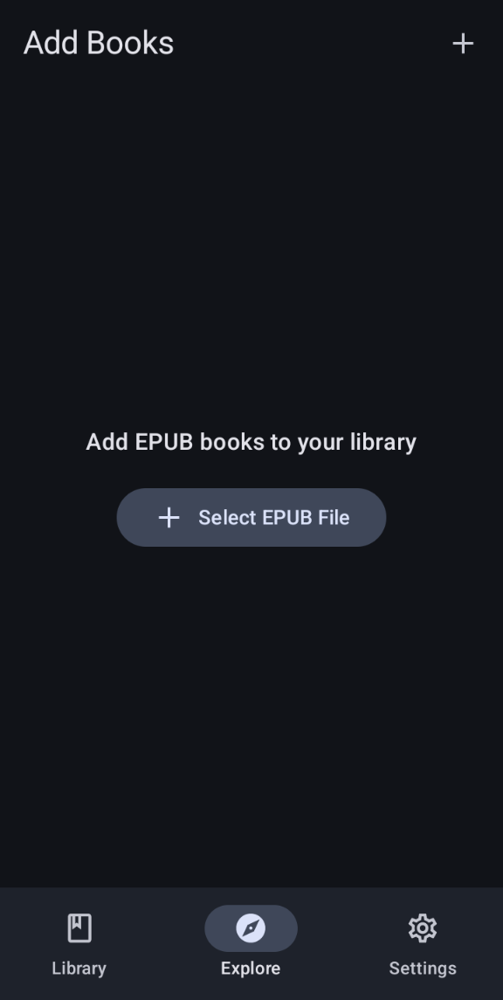
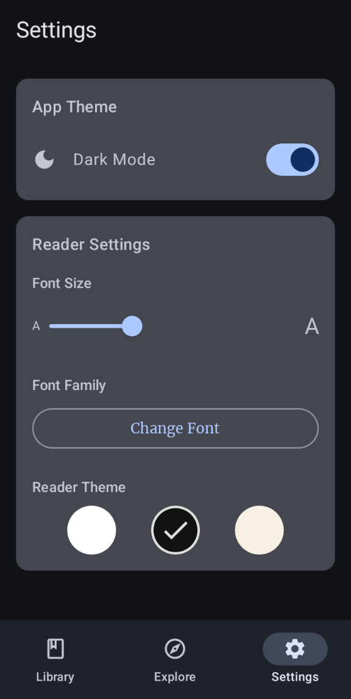

# Vera Reader

Here's another EPUB reader. Built it with Jetpack Compose during those quiet hours when sleep feels optional and code feels necessary. 3700 lines of code that work better than they should.

## The Truth About This Reader

Here's the thing: I built this reader, and I don't use it. Not because it's bad - it does everything right. Fast loading, clean text, remembers your spot. But there's an old programming truth that hits like yesterday's homemade whiskey: "If a developer won't use their own creation, why should anyone else?"

Maybe that's what makes this honest. No false promises. No "best reader ever" claims. Just code that works, waiting for someone who needs exactly what it offers. Like a perfectly good chair at a thrift store, waiting for the right person to sit in it.

## What It Does

Reads books. Digital ones. Does it without fuss or fanfare. Fast enough to keep up with your thoughts, light enough to let your battery breathe. The kind of reader that remembers where you stopped, like a faithful bartender who knows your drink.

## The Good Parts

- Clean interface that doesn't try to be clever
- Remembers your spot, every time
- Handles images like they matter
- Works offline because the internet isn't forever
- Battery life that lasts longer than your attention span

## Reading Options

Fifteen fonts, from the elegant Garamond to the sturdy Roboto. Size adjustments that go from whisper to shout. Three themes:
- Light (for the morning after)
- Dark (for the 3 AM sessions)
- Sepia (for the ones who still remember paperbacks)

## Screenshots
 
|              Library               |                Finder                |
|:----------------------------------:|:------------------------------------:|
|        |           |
|               Reader               |              Settings                |
|         |         |

## Under the Hood

Built with the good stuff:
- Jetpack Compose: Because XML layouts are yesterday's news
- Material Design 3: Modern, clean, gets out of your way
- Kotlin: No null pointer exceptions to ruin your night
- Room Database: Keeps your books in line
- Hilt: Dependency injection without the headache

## What You Need

- Android Studio Hedgehog or newer
- Android 8.0+ device
- Will to read

## Getting Started

git clone https://github.com/malcolmreed-ent/Vera.git

Open it. Build it. Read something worth reading.

## The Blueprint
app/src/main/java/com/logan/vera/
├── data/ # Where the truth lives
├── di/ # Keeps things honest
├── epub/ # Handles the words
├── ui/ # What you see
└── utils/ # Makes it all work

## Want to Help?

Found a bug? Fixed a bug? Know how to make it better? Pull requests welcome. Just keep it clean, tested, and working.

## The Fine Print

MIT License. Take it. Use it. Make it better.

## Thanks To

Not that it matters much, but this thing stands on the shoulders of others:
- Material Design team, for making things look less ugly
- JSoup, for dealing with the mess of parsing
- Coil, for handling images without complaints
- The folks at Acclorite and Nanihadesuka, who wrote code worth borrowing
- Coffee at 2 AM, when the bugs weren't fixing themselves
- That one stackoverflow answer from 2014 that still works

## Problems?

File an issue. Keep it simple. Tell it straight. Life's complicated enough.

---

Built by Malcolm Reed, for readers who might need it more than I do.
